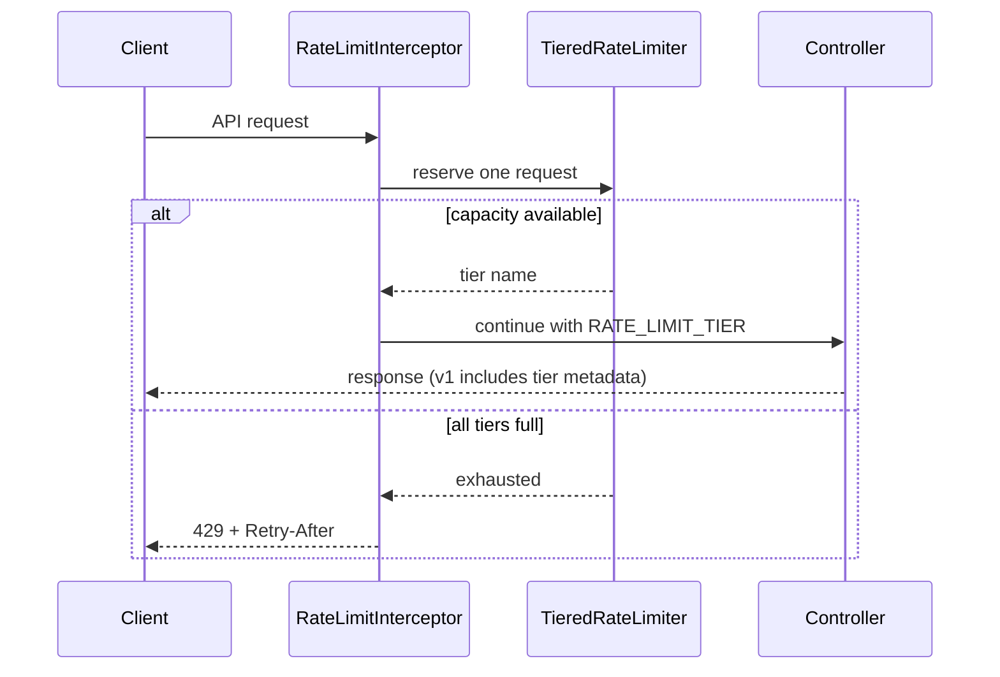

# Communication Hub

Communication Hub is a Java 17 / Spring Boot application with a small browser-based demo and REST APIs for four communication channels:

- **Chatbot:** a built-in, rule-based bot works without credentials. Optional Gemini integration provides AI replies.
- **Email:** sends email through the configured SMTP server (Gmail SMTP is preconfigured).
- **SMS:** sends text messages through Twilio.
- **WhatsApp:** sends WhatsApp messages through Twilio's WhatsApp sender or Sandbox.

The home page at `http://localhost:8081/` lets you try the channels from a browser. Chat in native mode works locally without external accounts. Email, SMS, WhatsApp, and AI chat require valid provider credentials and may incur charges or usage limits.

This is a demo application, not a production-ready messaging gateway. API routes have no authentication, so run it locally or behind appropriate access controls.

## Tiered API rate limiting

Every `/api/**` request passes through a process-wide, thread-safe fixed-window limiter before reaching a controller. It greedily reserves capacity from the first available tier:

1. **Instant** — direct processing.
2. **Async** — the next admission budget when Instant is full.
3. **Manual** — the final admission budget before rejection.

These tiers classify admitted traffic; they do not currently enqueue work or start a manual workflow. When all budgets are consumed, the app returns HTTP `429` with a `Retry-After` header and:

```json
{"error":"Too Many Requests","message":"System saturated. Retry later."}
```

The default process-wide capacities are 100 Instant, 200 Async, and 300 Manual requests per 60-second window. Override them with environment variables or `app.rate-limit.*` properties:

| Environment variable | Default | Meaning |
| --- | ---: | --- |
| `RATE_LIMIT_INSTANT_CAPACITY` | 100 | Direct tier capacity per window |
| `RATE_LIMIT_ASYNC_CAPACITY` | 200 | Second tier capacity per window |
| `RATE_LIMIT_MANUAL_CAPACITY` | 300 | Final tier capacity per window |
| `RATE_LIMIT_WINDOW_SECONDS` | 60 | Fixed-window duration |



## API endpoints

Versioned routes are available under `/api/v1/`. Their successful responses contain `data` and `rateLimitTier`. Existing `/api/...` routes remain as compatible aliases with their original response shape.

| Endpoint | JSON request | Versioned success response |
| --- | --- | --- |
| `POST /api/v1/chat` | `{"message":"hello","mode":"native","sessionId":"demo"}` | `{"data":{"reply":"Hello! How can I help you today?","mode":"native"},"rateLimitTier":"Instant"}` |
| `POST /api/v1/email/send` | `{"to":"person@example.com","subject":"Hello","body":"Demo message"}` | `{"data":"Email sent to person@example.com","rateLimitTier":"Instant"}` |
| `POST /api/v1/sms/send` | `{"to":"+1234567890","message":"Demo message"}` | `{"data":"SMS sent: ...","rateLimitTier":"Instant"}` |
| `POST /api/v1/whatsapp/send` | `{"to":"+1234567890","message":"Demo message"}` | `{"data":"WhatsApp sent: ...","rateLimitTier":"Instant"}` |

Successful requests return `200`; invalid request bodies return `400`; requests beyond the combined tier budget return `429`. OPTIONS preflight requests are not charged. `/actuator/**` and `/swagger-ui/**` are not intercepted.

## Quick start

Install Java 17 or newer and Maven. From the repository root:

```powershell
cd showground_01\communication-hub
mvn spring-boot:run
```

Open `http://localhost:8081/`. The server listens on port `8081` by default.

### Configure provider credentials

Use [`.env.example`](./showground_01/communication-hub/.env.example) as a list of supported variable names and safe placeholders. Spring Boot does **not** load `.env` files automatically. Set variables in the terminal or configure them in your IDE's run configuration before starting Maven. In PowerShell, for example:

```powershell
$env:GEMINI_API_KEY = "your-gemini-key"
$env:MAIL_USERNAME = "you@gmail.com"
$env:APP_PASSWORD = "your-gmail-app-password"
mvn spring-boot:run
```

Set only the variables needed for the features you intend to try. To test SMS and WhatsApp, also configure the Twilio values listed below. These PowerShell variables apply only to that terminal session. Do not put real keys in source files, README examples, screenshots, or commits. The Gemini API key has no embedded default and is read from `GEMINI_API_KEY`.

#### Gmail SMTP (email)

The application uses Gmail SMTP (`smtp.gmail.com`, port `587`) by default.

1. Use a Google account with **2-Step Verification** enabled.
2. Open Google's [App Passwords](https://myaccount.google.com/apppasswords) page while signed in, create an app password, and copy it when Google displays it. If the page is unavailable, check Google's [App Passwords help](https://support.google.com/accounts/answer/185833?hl=en); some account types or security policies do not permit app passwords.
3. Set `MAIL_USERNAME` to the Gmail address and `APP_PASSWORD` to the generated app password. Use the app password, not your normal Google account password.

App passwords grant access to the account; keep them private and revoke them in your Google account if exposed.

#### Gemini AI chatbot

The chatbot's **AI** mode uses Google's Gemini API. The native chatbot does not need a key.

1. Sign in to [Google AI Studio](https://aistudio.google.com/).
2. Open the [API key page](https://aistudio.google.com/app/apikey) and create an API key for a Google Cloud project.
3. Set `GEMINI_API_KEY` to that key. Review Google's current [Gemini API pricing and limits](https://ai.google.dev/gemini-api/docs/pricing) before using it.

Treat the key as a secret and restrict or rotate it in Google AI Studio if it is exposed.

#### Twilio SMS

1. Create or sign in to a [Twilio account](https://www.twilio.com/try-twilio).
2. In the [Twilio Console](https://console.twilio.com/), find the Account SID and Auth Token on the account dashboard.
3. Get an SMS-capable Twilio phone number from **Phone Numbers** in the Console.
4. Set `TWILIO_ACCOUNT_SID`, `TWILIO_AUTH_TOKEN`, and `TWILIO_FROM` to those values. The recipient number must be in international E.164 format (for example, `+14155550123`).

Trial accounts typically restrict recipients to verified numbers. Check the Console for current trial rules, number availability, country coverage, and messaging charges.

#### Twilio WhatsApp

For a quick demo, use the [Twilio WhatsApp Sandbox](https://www.twilio.com/docs/whatsapp/sandbox):

1. In the Twilio Console, open **Messaging → Try it out → Send a WhatsApp message** (Console labels can change).
2. Follow the displayed instructions to join the Sandbox from your WhatsApp account.
3. Set `TWILIO_ACCOUNT_SID` and `TWILIO_AUTH_TOKEN` as for SMS. Set `TWILIO_WHATSAPP_FROM` to the Sandbox sender shown in the Console, commonly `whatsapp:+14155238886`.
4. Enter a WhatsApp recipient number in international format in the demo. The recipient must join the Sandbox first.

For production messaging, configure an approved WhatsApp sender in Twilio and follow Twilio's current [WhatsApp sender setup](https://www.twilio.com/docs/whatsapp).

#### Rate-limit settings

These settings are optional; the defaults are 100 Instant, 200 Async, and 300 Manual requests per 60-second window:

| Environment variable | Default | Purpose |
| --- | ---: | --- |
| `RATE_LIMIT_INSTANT_CAPACITY` | 100 | Direct tier capacity per window |
| `RATE_LIMIT_ASYNC_CAPACITY` | 200 | Second tier capacity per window |
| `RATE_LIMIT_MANUAL_CAPACITY` | 300 | Final tier capacity per window |
| `RATE_LIMIT_WINDOW_SECONDS` | 60 | Fixed-window duration |

Run the unit and MockMvc integration tests with:

```powershell
cd showground_01\communication-hub
mvn test
```
