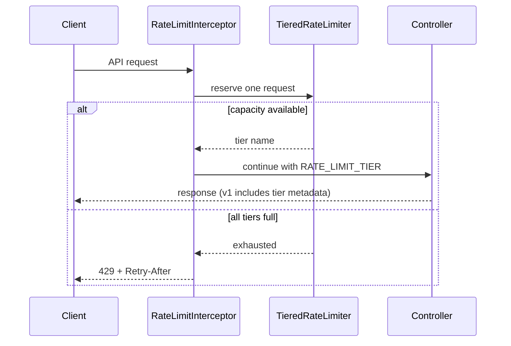

# Communication Hub

A Spring Boot demo API for chatbot, email, SMS, and WhatsApp messaging. The demo endpoints are unauthenticated so they can be tried locally without setting up a login.

## Tiered API rate limiting

Every `/api/**` request passes through a process-wide, thread-safe fixed-window limiter before reaching a controller. It greedily reserves capacity from the first available tier:

1. **Instant** — direct processing.
2. **Async** — the next admission budget when Instant is full.
3. **Manual** — the final admission budget before rejection.

These tiers classify admitted traffic; they do not currently enqueue work or start a manual workflow. When all budgets are consumed, the app returns HTTP `429` with a `Retry-After` header and:

```json
{"error":"Too Many Requests","message":"System saturated. Retry later."}
```

The default process-wide capacities are 100 Instant, 200 Async, and 300 Manual requests per 60-second window. Override them with environment variables or `app.rate-limit.*` properties:

| Environment variable | Default | Meaning |
| --- | ---: | --- |
| `RATE_LIMIT_INSTANT_CAPACITY` | 100 | Direct tier capacity per window |
| `RATE_LIMIT_ASYNC_CAPACITY` | 200 | Second tier capacity per window |
| `RATE_LIMIT_MANUAL_CAPACITY` | 300 | Final tier capacity per window |
| `RATE_LIMIT_WINDOW_SECONDS` | 60 | Fixed-window duration |



## API endpoints

Versioned routes are available under `/api/v1/`. Their successful responses contain `data` and `rateLimitTier`. Existing `/api/...` routes remain as compatible aliases with their original response shape.

| Endpoint | JSON request | Versioned success response |
| --- | --- | --- |
| `POST /api/v1/chat` | `{"message":"hello","mode":"native","sessionId":"demo"}` | `{"data":{"reply":"Hello! How can I help you today?","mode":"native"},"rateLimitTier":"Instant"}` |
| `POST /api/v1/email/send` | `{"to":"person@example.com","subject":"Hello","body":"Demo message"}` | `{"data":"Email sent to person@example.com","rateLimitTier":"Instant"}` |
| `POST /api/v1/sms/send` | `{"to":"+1234567890","message":"Demo message"}` | `{"data":"SMS sent: ...","rateLimitTier":"Instant"}` |
| `POST /api/v1/whatsapp/send` | `{"to":"+1234567890","message":"Demo message"}` | `{"data":"WhatsApp sent: ...","rateLimitTier":"Instant"}` |

Successful requests return `200`; invalid request bodies return `400`; requests beyond the combined tier budget return `429`. OPTIONS preflight requests are not charged. `/actuator/**` and `/swagger-ui/**` are not intercepted.

## Run locally

Use Java 17+ and Maven:

```powershell
mvn spring-boot:run
```

The web demo is served at `http://localhost:8081/`. Configure provider credentials as environment variables using `.env.example` as a reference. The Gemini API key is read only from `GEMINI_API_KEY`; it has no embedded default. Keep real credentials in an ignored `.env` file or your environment and never commit them. This demo has no authentication and should not be exposed to untrusted networks.

Run the unit and MockMvc integration tests with:

```powershell
mvn test
```